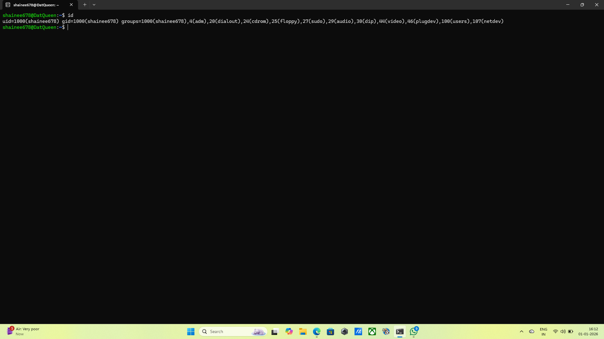
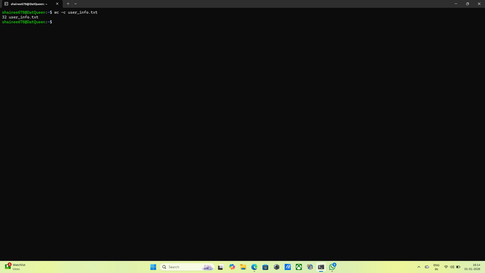
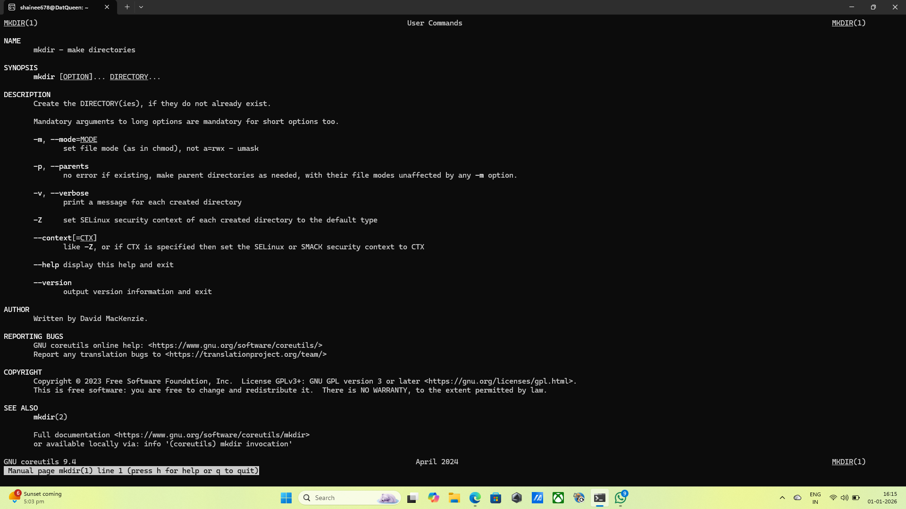
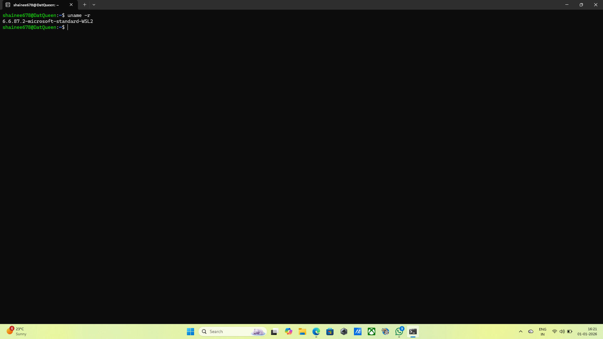
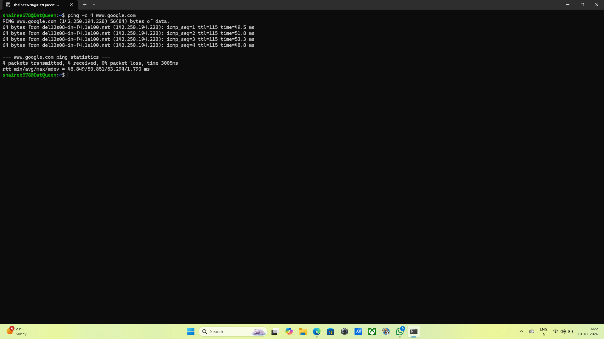

### 1.User Identity Verification
*Commands:* id
*Output:* uid=1000(shainee678) gid=1000(shainee678) groups=1000(shainee678),4(adm),20(dialout),24(cdrom),25(floppy),27(sudo),29(audio),30(dip),44(video),46(plugdev),100(users),107(netdev)
*Explanation:* I ran the id command to display my current UID, GID, and all groups, my account belongs to, ensuring my login ID is visible in the output.
*Screenshot:* 

### 2.Workspace Validation
*Commands:* pwd followed by ls -l
*Output:* when pwd command is given:
/home/shainee678

when ls -l command is given:
total 12
-rw-r--r-- 1 shainee678 shainee678   23 Jan  1 10:49 log.txt
drwxr-xr-x 3 shainee678 shainee678 4096 Jan  1 11:19 project_documents
-rw-r--r-- 1 shainee678 shainee678   32 Jan  1 10:43 user_info.txt
*Explanation:* I used pwd to show the full path of my current working directory and ls -l to list all files using the long format for detailed information.
*Screenshot:* 

### 3.Environment Confirmation File
*Commands*: echo "Linux user environment verified" > user_info.txt
*Output:* 
*Explanation:* I created a new text file named user_info.txt and wrote the required verification string into it using output redirection.
*Screenshot:* 

### 4.File Integrity Check
*Commands:* wc -c user_info.txt
*Output:* 32 user_info.txt
*Explanation:* I used the wc command with the -c flag to count and display the total number of characters present in the user_info.txt file.
*Screenshot:* 

### 5.Learning the tools
*Commands:* man mkdir
*Output:* MKDIR(1)                                                                                       User Commands                                                                                       MKDIR(1)

NAME
       mkdir - make directories

SYNOPSIS
       mkdir [OPTION]... DIRECTORY...

DESCRIPTION
       Create the DIRECTORY(ies), if they do not already exist.

       Mandatory arguments to long options are mandatory for short options too.

       -m, --mode=MODE
              set file mode (as in chmod), not a=rwx - umask

       -p, --parents
              no error if existing, make parent directories as needed, with their file modes unaffected by any -m option.

       -v, --verbose
              print a message for each created directory

       -Z     set SELinux security context of each created directory to the default type

       --context[=CTX]
              like -Z, or if CTX is specified then set the SELinux or SMACK security context to CTX

       --help display this help and exit

       --version
              output version information and exit

AUTHOR
       Written by David MacKenzie.

REPORTING BUGS
       GNU coreutils online help: <https://www.gnu.org/software/coreutils/>
       Report any translation bugs to <https://translationproject.org/team/>

COPYRIGHT
       Copyright © 2023 Free Software Foundation, Inc.  License GPLv3+: GNU GPL version 3 or later <https://gnu.org/licenses/gpl.html>.
       This is free software: you are free to change and redistribute it.  There is NO WARRANTY, to the extent permitted by law.

SEE ALSO
       mkdir(2)

       Full documentation <https://www.gnu.org/software/coreutils/mkdir>
       or available locally via: info '(coreutils) mkdir invocation'

GNU coreutils 9.4                                                                                April 2024                                                                                        MKDIR(1)
 Manual page mkdir(1) line 1 (press h for help or q to quit)
*Explanation:* I accessed the manual page for mkdir to identify useful options such as -p, which allows the creation of parent directories as needed.
*Screenshot:* 

### 6.Home Directory Inspection
*Commands:* ls ~
*Output:* log.txt  project_documents  user_info.txt
*Explanation:* I listed the contents of my home directory; by default, the output is sorted alphabetically, satisfying the environment check requirement.
*Screenshot:* 

### 7.Log Investigation
*Commands:* grep "admin" log.txt
*Output:* The admin is logged in
*Explanation:* I utilised the grep command to search for the specific keyword "admin" inside log.txt and display only the lines that matched, after creating a file using the command 
              echo "The admin is logged in" > log.txt
*Screenshot:* 

### 8.System Information Check
*Commands:* uname -r
*Output:* 6.6.87.2-microsoft-standard-WSL2
*Explanation:*  I executed uname -r to retrieve and display the specific version of the Linux kennel currently running on the lab machine.
*Screenshot:* 

### 9.Network Connectivity Test
*Commands:* ping -c 4 www.google.com
*Output:* PING www.google.com (142.250.67.196) 56(84) bytes of data.
64 bytes from bom12s08-in-f4.1e100.net (142.250.67.196): icmp_seq=1 ttl=116 time=48.0 ms
64 bytes from bom12s08-in-f4.1e100.net (142.250.67.196): icmp_seq=2 ttl=116 time=47.8 ms
64 bytes from bom12s08-in-f4.1e100.net (142.250.67.196): icmp_seq=3 ttl=116 time=48.8 ms
64 bytes from bom12s08-in-f4.1e100.net (142.250.67.196): icmp_seq=4 ttl=116 time=49.4 ms

--- www.google.com ping statistics ---
4 packets transmitted, 4 received, 0% packet loss, time 3097ms
rtt min/avg/max/mdev = 47.797/48.518/49.430/0.653 ms
*Explanation:* I sent 4 ICMP echo request packets to Google's server to verify that the lab machine has active outbound network connectivity.
*Screenshot:* 

### 10.System Health Awareness
*Commands:* uptime
*Output:* 15:53:07 up  1:13,  1 user,  load average: 0.00, 0.00, 0.00
*Explanation:* I ran the uptime command to view the system's total run time, the number of logged-in users, and the current CPU load averages.
*Screenshot:* 
