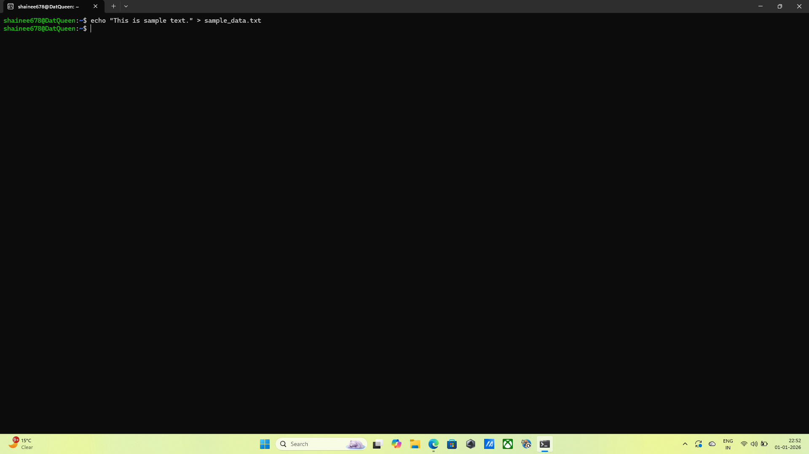
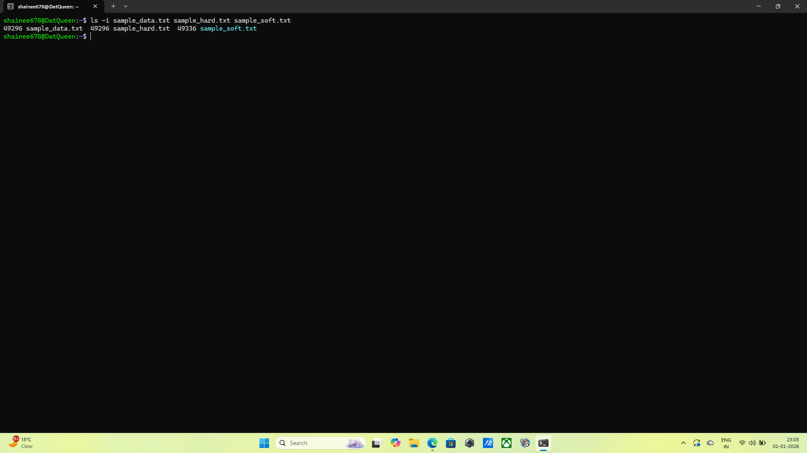
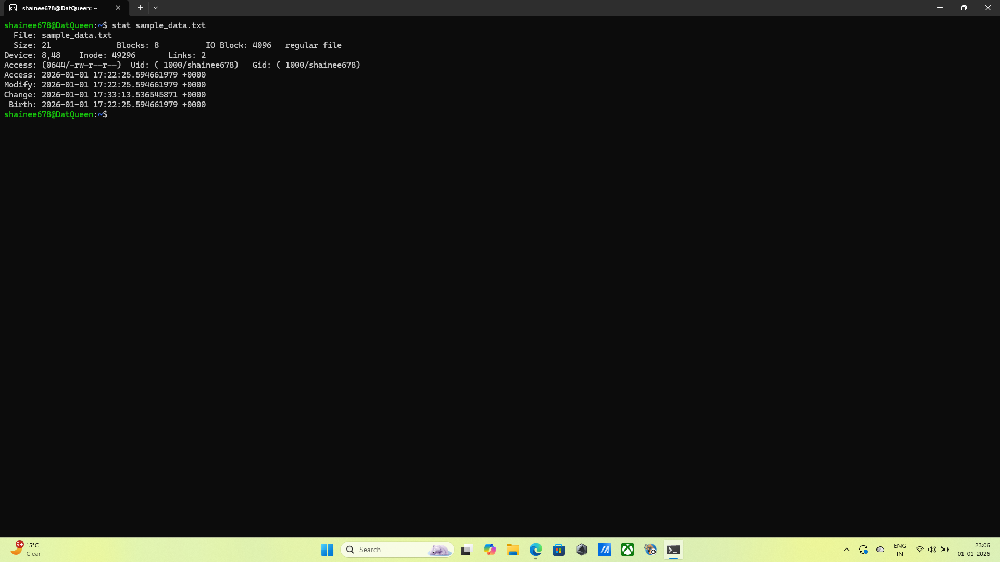
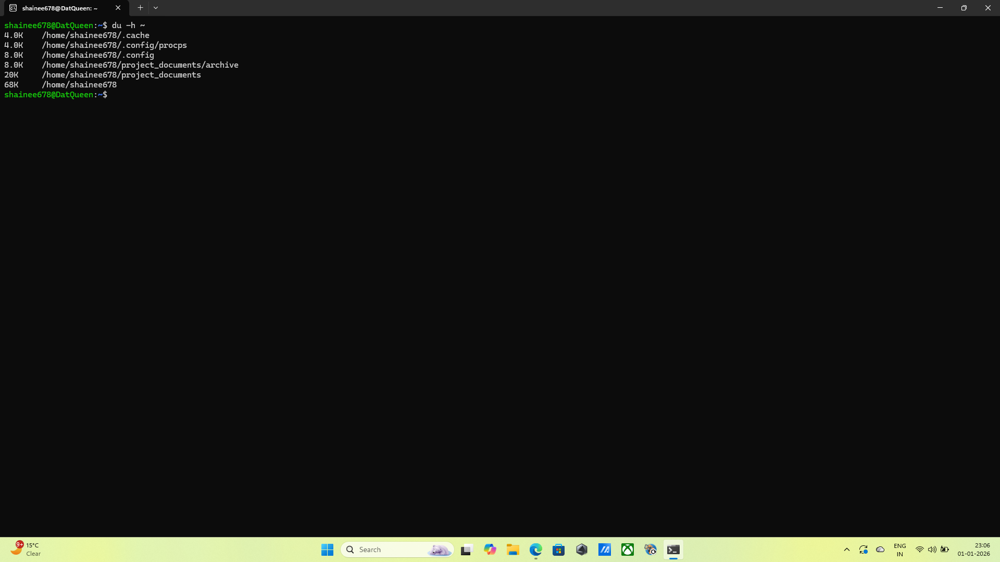
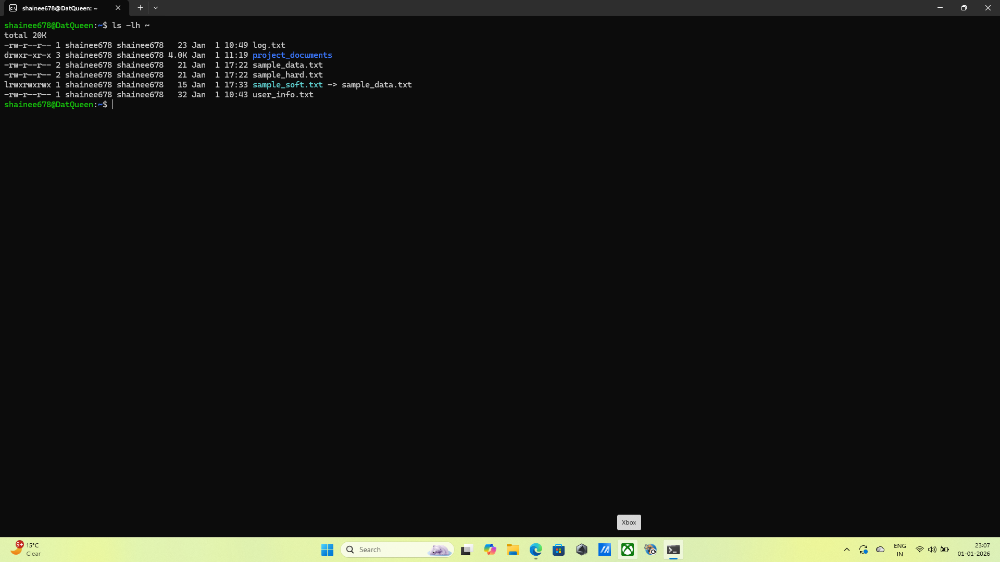
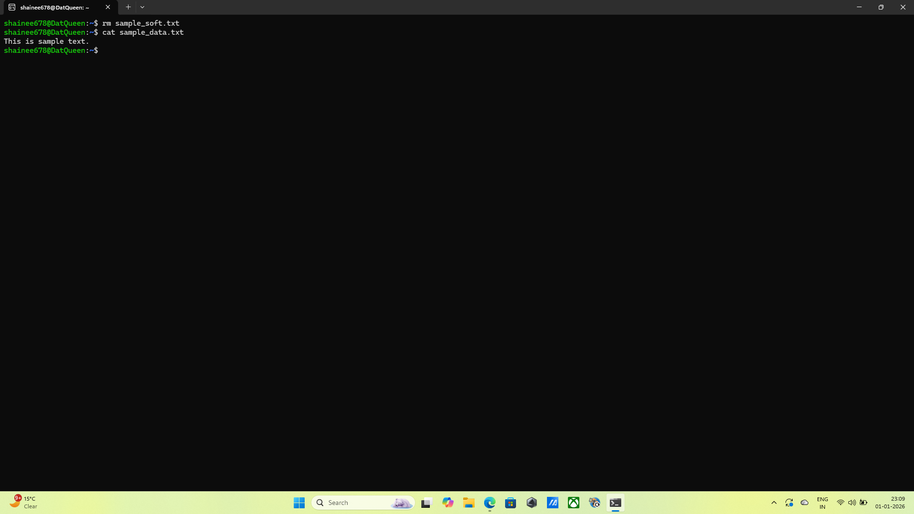
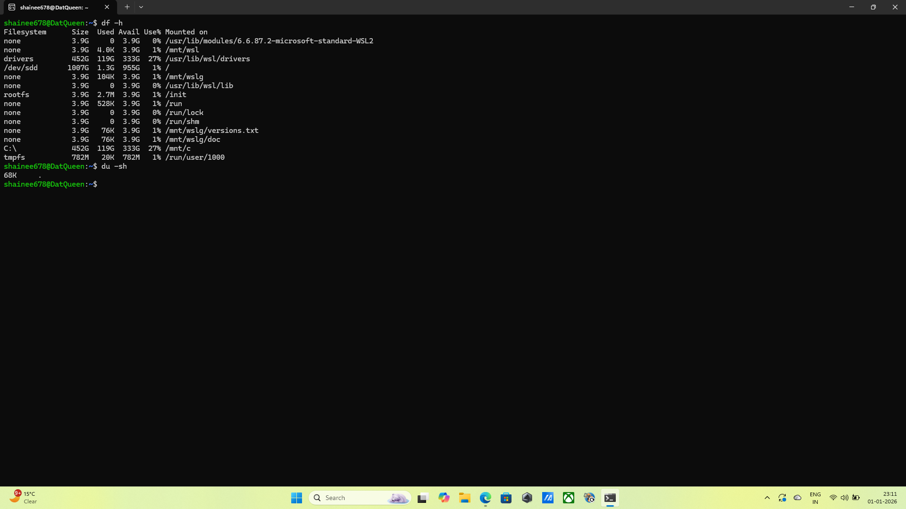

### 1.File Creation
* *Command:* echo "This is sample text." > sample_data.txt
* *Output:* No output was given by terminal but the command was executed succesfully.
* *Explanation:* I created a new file named sample_data.txt in my home directory and added basic text content to it.
* *Screenshot:* 

### 2.Hard Link Creation
* *Command:* ln sample_data.txt sample_hard.txt
* *Output:* No output was given by terminal but the command was executed succesfully.
* *Explanation:* I created a hard link called sample_hard.txt that points to the same physical data on the disk as the original file.
* *Screenshot:* 

  
 ### 3.Symbolic Link Creation
* *Command:* ln -s sample_data.txt sample_soft.txt
* *Output:* No output was given by terminal but the command was executed succesfully.
* *Explanation:* I created a symbolic (soft) link named sample_soft.txt, which acts as a shortcut pointing to the original filename.
* *Screenshot:* 

 ### 4.Inode Verification
* *Command:* ls -i sample_data.txt sample_hard.txt sample_soft.txt
* *Output:* 49296 sample_data.txt  49296 sample_hard.txt  49336 sample_soft.txt
* *Explanation:* I used the -i flag to display the inode numbers for all three files to compare how the system tracks them internally.
* *Screenshot:* 

 ### 5.Inode Analysis
* *Command:* no command
* *Output:* observation based on task 4
* *Explanation:*  I observed that the original file and the hard link share the same inode number because they are different names for the same data. The soft link has a
                   unique inode because it is a separate file that merely points to a path.
* *Screenshot:* 

  ### 6.File Metadata Inspection
* *Command:* stat sample_data.txt
* *Output:* File: sample_data.txt
  Size: 21              Blocks: 8          IO Block: 4096   regular file
Device: 8,48    Inode: 49296       Links: 2
Access: (0644/-rw-r--r--)  Uid: ( 1000/shainee678)   Gid: ( 1000/shainee678)
Access: 2026-01-01 17:22:25.594661979 +0000
Modify: 2026-01-01 17:22:25.594661979 +0000
Change: 2026-01-01 17:33:13.536545871 +0000
 Birth: 2026-01-01 17:22:25.594661979 +0000
* *Explanation:*  I used the stat command to view detailed metadata, including the file permissions, ownership, and exact timestamps.
* *Screenshot:* 
 
  ### 7.Disk Usage Check
* *Command:* du -h ~
* *Output:* 4.0K    /home/shainee678/.cache
4.0K    /home/shainee678/.config/procps
8.0K    /home/shainee678/.config
8.0K    /home/shainee678/project_documents/archive
20K     /home/shainee678/project_documents
68K     /home/shainee678
* *Explanation:* I checked the disk usage of my home directory in a human-readable format to see the total size occupied by my files.
* *Screenshot:* 

  ### 8.File Size Overview
* *Command:* ls -lh ~
* *Output:* total 20K
-rw-r--r-- 1 shainee678 shainee678   23 Jan  1 10:49 log.txt
drwxr-xr-x 3 shainee678 shainee678 4.0K Jan  1 11:19 project_documents
-rw-r--r-- 2 shainee678 shainee678   21 Jan  1 17:22 sample_data.txt
-rw-r--r-- 2 shainee678 shainee678   21 Jan  1 17:22 sample_hard.txt
lrwxrwxrwx 1 shainee678 shainee678   15 Jan  1 17:33 sample_soft.txt -> sample_data.txt
-rw-r--r-- 1 shainee678 shainee678   32 Jan  1 10:43 user_info.txt
* *Explanation:* I listed all files in my home directory with the -h flag to see their individual sizes in Kilobytes or Megabytes.
* *Screenshot:* 

  ### 9.Link Deletion Test
* *Command:* rm sample_soft.txt then cat sample_data.txt
* *Output:* the rm command deletes the symbolic link so no output is given by the terminal and the cat command generates this output: This is sample text.
* *Explanation:* I deleted the symbolic link and verified that the original data remained perfectly intact and accessible.
* *Screenshot:* 

  ### 10.Disk Utility Demonstration
* *Command:* df -h and du -sh
* *Output:* when the command is df -h:
* Filesystem      Size  Used Avail Use% Mounted on
none            3.9G     0  3.9G   0% /usr/lib/modules/6.6.87.2-microsoft-standard-WSL2
none            3.9G  4.0K  3.9G   1% /mnt/wsl
drivers         452G  119G  333G  27% /usr/lib/wsl/drivers
/dev/sdd       1007G  1.3G  955G   1% /
none            3.9G  104K  3.9G   1% /mnt/wslg
none            3.9G     0  3.9G   0% /usr/lib/wsl/lib
rootfs          3.9G  2.7M  3.9G   1% /init
none            3.9G  528K  3.9G   1% /run
none            3.9G     0  3.9G   0% /run/lock
none            3.9G     0  3.9G   0% /run/shm
none            3.9G   76K  3.9G   1% /mnt/wslg/versions.txt
none            3.9G   76K  3.9G   1% /mnt/wslg/doc
C:\             452G  119G  333G  27% /mnt/c
tmpfs           782M   20K  782M   1% /run/user/1000

when the command is du -sh:
68K 
* *Explanation:* I ran both df and du to compare filesystem-wide availability against the specific space used by my current directory.
* *Screenshot:* 
