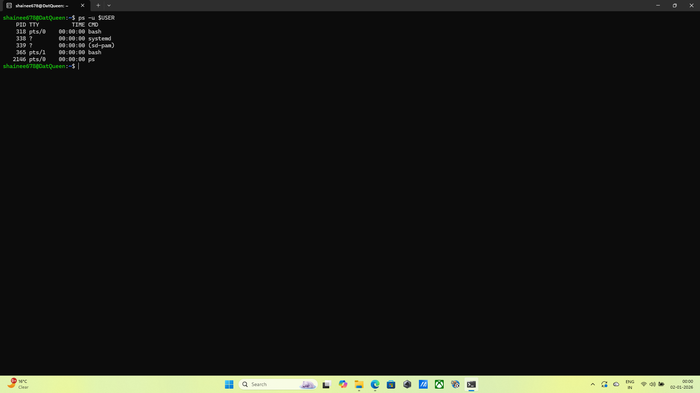
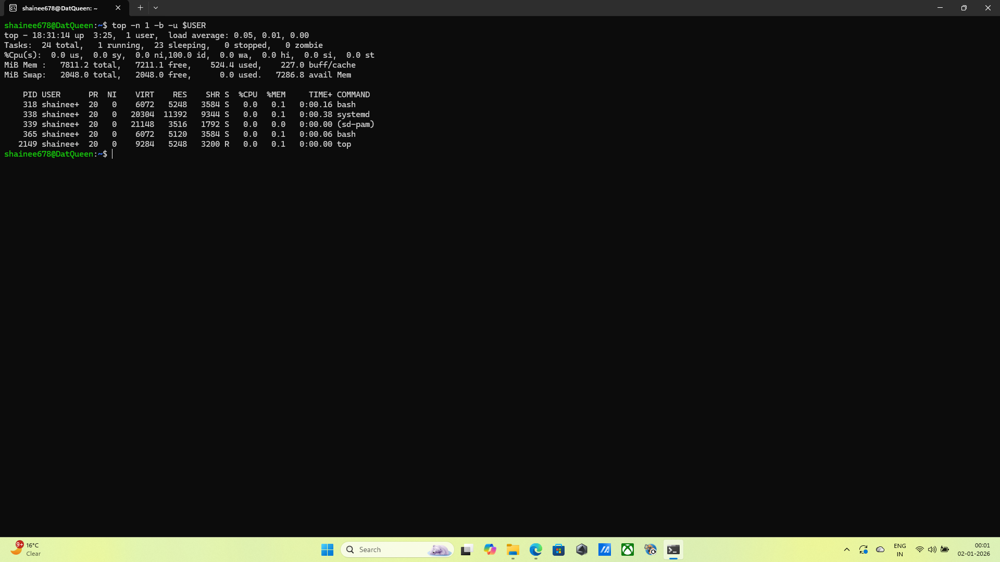
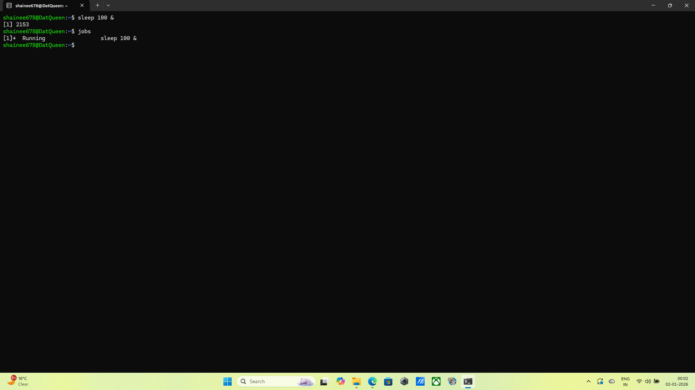
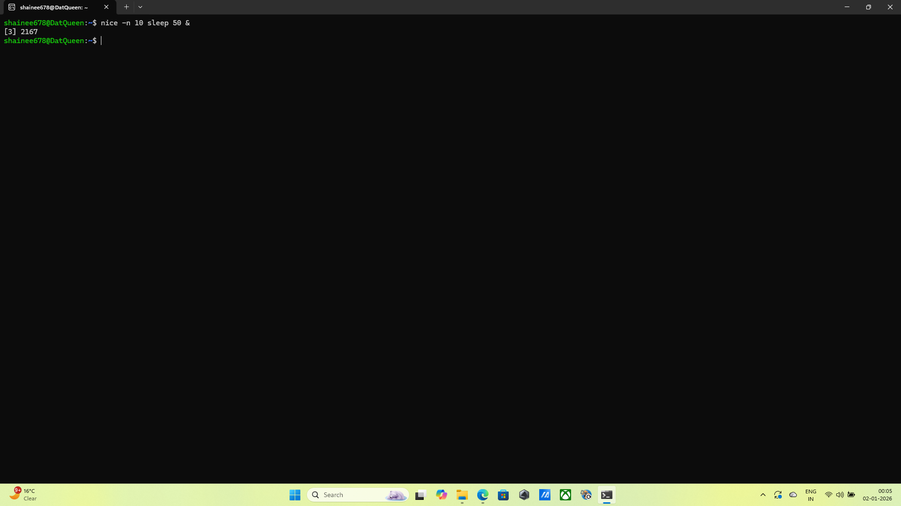
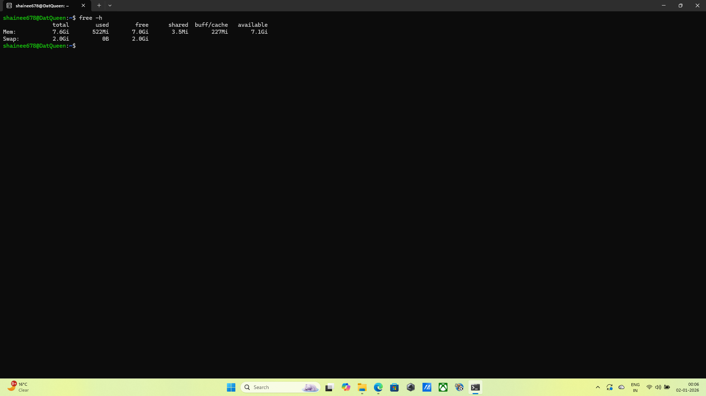
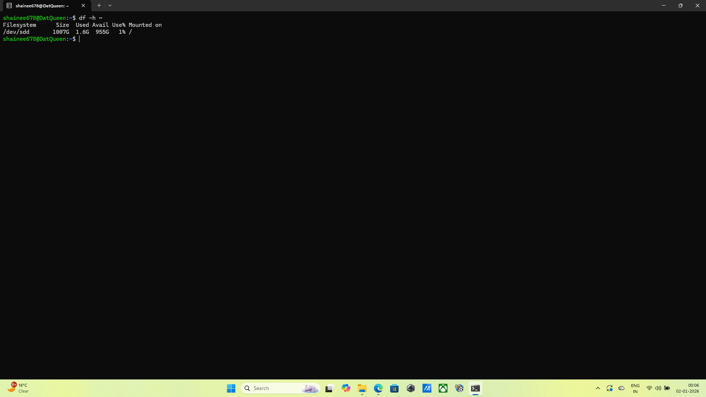

### 1.System Uptime Verification
*Commands:* uptime
*Output:* 18:30:18 up  3:24,  1 user,  load average: 0.00, 0.00, 0.00
*Explanation:* I executed the uptime command to view how long the system has been running since the last boot. I observed the current time, the duration of uptime, and the load averages.
*Screenshot:* 

### 2.User Process Listing
*Commands:* ps -u $USER
*Output:* PID TTY          TIME CMD
    318 pts/0    00:00:00 bash
    338 ?        00:00:00 systemd
    339 ?        00:00:00 (sd-pam)
    365 pts/1    00:00:00 bash
   2146 pts/0    00:00:00 ps
*Explanation:* I used this command to list all active processes owned by my specific user account. The output displayed the PID, terminal type, and execution time for each of my processes.
*Screenshot:* 

### 3.CPU Usage Analysis
*Commands:* top -n 1 -b -u $USER
*Output:* top - 18:31:14 up  3:25,  1 user,  load average: 0.05, 0.01, 0.00
Tasks:  24 total,   1 running,  23 sleeping,   0 stopped,   0 zombie
%Cpu(s):  0.0 us,  0.0 sy,  0.0 ni,100.0 id,  0.0 wa,  0.0 hi,  0.0 si,  0.0 st
MiB Mem :   7811.2 total,   7211.1 free,    524.4 used,    227.0 buff/cache
MiB Swap:   2048.0 total,   2048.0 free,      0.0 used.   7286.8 avail Mem

    PID USER      PR  NI    VIRT    RES    SHR S  %CPU  %MEM     TIME+ COMMAND
    318 shainee+  20   0    6072   5248   3584 S   0.0   0.1   0:00.16 bash
    338 shainee+  20   0   20304  11392   9344 S   0.0   0.1   0:00.38 systemd
    339 shainee+  20   0   21148   3516   1792 S   0.0   0.0   0:00.00 (sd-pam)
    365 shainee+  20   0    6072   5120   3584 S   0.0   0.1   0:00.06 bash
   2149 shainee+  20   0    9284   5248   3200 R   0.0   0.1   0:00.00 top
*Explanation:* I launched the top utility filtered for my username to monitor real time resource usage. This allowed me to identify which specific process was consuming the highest percentage of CPU.
*Screenshot:* 

### 4.Background Process Execution
*Commands:* sleep 100 & followed by jobs
*Output:* After running sleep 100 & command we get: [1] 2153 and the output for jobs command is: [1]+  Running                 sleep 100 &
*Explanation:* I started a sleep command in the background using the & symbol. I then ran jobs to verify that the process was indeed running in the background without blocking the terminal.
*Screenshot:* 

### 5.Process Priority Management
*Commands:* nice -n 10 sleep 50 &
*Output:* [3] 2167
          [2]-  Done                    nice -n 10 sleep 50
          [3]+  Done                    nice -n 10 sleep 50
*Explanation:* I intiated a new process with a modified "niceness" value of 10 to change its scheduling priority. By checking the process status, I confirmed the updated priority level compared to standard processes.
*Screenshot:* 

### 6.Memory Usage Monitoring
*Commands:* free -h
*Output:* total        used        free      shared  buff/cache   available
Mem:           7.6Gi       522Mi       7.0Gi       3.5Mi       227Mi       7.1Gi
Swap:          2.0Gi          0B       2.0Gi
*Explanation:* I ran the free command with the -h flag to display system memory usage. This provided a human-readable summary of total, used, and available RAM and swap space.
*Screenshot:* 

### 7.Disk Space Inspection
*Commands:* df -h ~
*Output:* Filesystem      Size  Used Avail Use% Mounted on
          /dev/sdd       1007G  1.6G  955G   1% /
*Explanation:* I checked the disk space for the filesystem containing my home directory using the df command. The output showed the disk capacity and the percentage of space currently utilised.
*Screenshot:* 

### 8.Shell Identification
*Commands:* echo $SHELL
*Output:* /bin/bash
*Explanation:* I accessed the $SHELL environment variable to identify the command line interpreter currently in use. The output confirmed that I am using the /bin/bash (or /bin/zsh) shell.
*Screenshot:* 

### 9.Output Redirection
*Commands:* uname -a > system_report.txt
*Output:* No output from the terminal but the command was executed suuccesfully
*Explanation:* I redirected the output of the uname command into a new file called system_report.txt. This saved my system's kernel and hardware information into a permanent text file.
*Screenshot:* 

### 10.Disk Usage Visualisation
*Commands:* du -sh
*Output:* 72K 
*Explanation:* I used this to visualise which directories are taking up the most space in my home folder. The output shows that my home folder is almost empty or only contains a few small configuration files.
*Screenshot:* 
